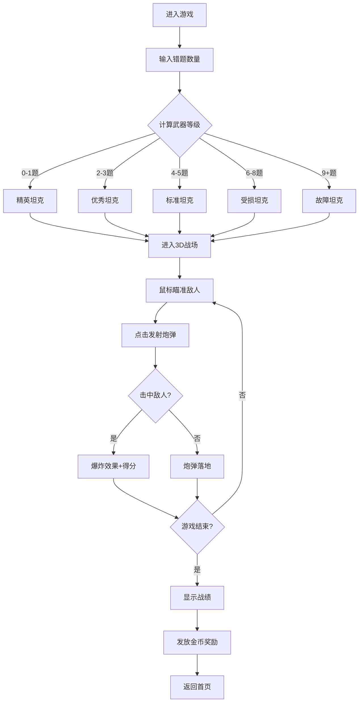

# 数学错题坦克大战 - 产品需求文档 (PRD)

## 1. 产品概述

一款激励孩子减少数学错题的3D坦克射击游戏。孩子每天输入当天的数学错题数量，错题越多，坦克的武器属性（射速、威力、精准度等）会被削弱；错题越少，坦克性能越强。通过游戏化的方式，让孩子主动认真对待数学作业。

**核心价值**：将学习表现与游戏体验直接挂钩，用正向激励和负面反馈机制培养孩子认真细致的学习习惯。

## 2. 核心功能

### 2.1 用户角色

| 角色 | 使用方式 | 核心权限 |
|------|----------|----------|
| 孩子 | 直接游戏 | 输入错题数量、进行坦克战斗、查看武器状态 |
| 家长 | 查看记录 | 查看历史错题数据和游戏表现（扩展功能） |

### 2.2 功能模块

1. **错题录入页面**：输入当天数学错题数量，系统根据错题数计算坦克武器等级
2. **3D战斗页面**：第一人称坦克视角，鼠标控制炮管瞄准，点击发射炮弹
3. **武器状态面板**：显示当前坦克的各项属性（射速、威力、精准度、装填速度）
4. **战斗结果页面**：显示击毁敌人数量、获得奖励、鼓励语

### 2.3 页面详情

| 页面名称 | 模块名称 | 功能描述 |
|----------|----------|----------|
| 错题录入页 | 数字输入 | 输入0-20的错题数量，数字越大表情越沮丧 |
| 错题录入页 | 武器预览 | 根据错题数显示坦克武器状态（优秀/良好/一般/较差） |
| 3D战斗页 | 3D场景 | 坦克后方第一视角，可见炮管，远处有敌人 |
| 3D战斗页 | 瞄准系统 | 鼠标移动控制炮管水平和垂直角度 |
| 3D战斗页 | 射击系统 | 点击鼠标发射抛物线炮弹，有后坐力效果 |
| 3D战斗页 | 战场氛围 | 烟雾、爆炸、音效、震动反馈 |
| 结果页 | 战绩统计 | 显示击毁数、命中率、获得金币 |
| 结果页 | 鼓励系统 | 根据错题数量给出不同的鼓励语 |

## 3. 核心流程

### 3.1 主流程描述

1. 孩子完成数学作业后，进入游戏
2. 输入当天数学错题数量（0-20题）
3. 系统根据错题数计算武器等级：
   - 0-1题：⭐⭐⭐⭐⭐ 精英坦克（最高属性）
   - 2-3题：⭐⭐⭐⭐ 优秀坦克
   - 4-5题：⭐⭐⭐ 标准坦克
   - 6-8题：⭐⭐ 受损坦克
   - 9题以上：⭐ 故障坦克（最低属性）
4. 进入3D战场，使用鼠标瞄准远处敌人
5. 点击发射炮弹，抛物线轨迹打击敌人
6. 敌人被击中后爆炸消失，获得分数
7. 时间结束或弹药耗尽后显示战绩
8. 根据表现获得金币奖励，存入账户

### 3.2 流程图

## 4. 用户界面设计

### 4.1 设计风格

**整体风格**：军事硬核风格 + 卡通渲染，营造严肃但不过度暴力的战场氛围

**配色方案**：
- 主色：军绿色 `#4A5D23`、钢铁灰 `#4A4A4A`
- 强调色：炮弹橙 `#FF6B35`、爆炸红 `#FF3333`
- 背景：战场黄昏渐变 `#1a1a2e` → `#16213e`
- UI：半透明深色面板 `rgba(0,0,0,0.7)` + 金色边框

**字体**：
- 标题：Russo One（军事风格）或 思源黑体 Heavy
- 正文：Roboto Condensed 或 思源黑体 Regular
- 数字：DSEG7（数码管风格）显示弹药和分数

**按钮风格**：
- 3D立体按钮，有按下效果
- 军事风格边框和纹理
- 悬停时有发光效果

### 4.2 页面设计概览

| 页面名称 | 模块名称 | UI元素 |
|----------|----------|--------|
| 错题录入页 | 标题区 | 军事风格标题，坦克图标 |
| 错题录入页 | 输入区 | 大数字输入框，+/-按钮，表情反馈 |
| 错题录入页 | 武器预览 | 五维属性雷达图，坦克模型预览 |
| 错题录入页 | 开始按钮 | 大型3D按钮，发光效果 |
| 3D战斗页 | 3D画布 | 全屏Three.js渲染 |
| 3D战斗页 | HUD界面 | 弹药数、得分、准星、小地图 |
| 3D战斗页 | 武器状态 | 底部属性条显示当前射速/威力 |
| 结果页 | 战绩卡片 | 击毁数、命中率、评级 |
| 结果页 | 奖励展示 | 金币动画，获得数量 |
| 结果页 | 鼓励语 | 根据表现显示不同文案 |

### 4.3 响应式设计

- **桌面优先**：主要针对PC端鼠标操作优化
- **全屏体验**：游戏页面全屏显示，沉浸式体验
- **性能适配**：根据设备性能自动调整画质

### 4.4 3D场景设计

**环境氛围**：
- 黄昏战场，远处有山脉轮廓
- 地面是沙土和碎石纹理
- 天空有橙红色晚霞和少量云层
- 远处有烟雾粒子效果营造战争氛围

**光照设置**：
- 主光源：黄昏太阳（暖橙色），产生长阴影
- 补光：环境光（蓝紫色）模拟天空反射
- 特效光：炮弹发射时的闪光、爆炸光

**相机设置**：
- 位置：坦克后方第一人称视角
- 能看到坦克炮管的前半部分
- 鼠标移动时炮管跟随，相机轻微跟随
- 发射时有后坐力震动效果

**战场元素**：
- 远处随机生成敌人坦克/目标
- 敌人有不同的距离和大小
- 地面有弹坑和障碍物
- 空中偶尔有飞鸟或烟雾

**交互与动画**：
- 鼠标移动 → 炮管水平/垂直旋转
- 鼠标点击 → 发射炮弹（后坐力动画）
- 炮弹飞行 → 抛物线轨迹，带尾焰
- 击中敌人 → 爆炸粒子效果
- 未击中 → 地面弹坑和尘土

**后处理效果**：
- 景深效果（远处模糊）
- 色调映射（HDR效果）
- 轻微颗粒感（胶片效果）
- 爆炸时的屏幕震动

## 5. 武器属性系统

### 5.1 五维属性

| 属性 | 说明 | 影响 |
|------|------|------|
| 射速 | 每分钟发射次数 | 错题多射速慢 |
| 威力 | 炮弹伤害值 | 错题多威力低 |
| 精准度 | 炮弹散布范围 | 错题多精准度差 |
| 装填 | 弹匣容量 | 错题多弹药少 |
| 射程 | 有效打击距离 | 错题多射程短 |

### 5.2 等级对应表

| 错题数 | 等级 | 射速 | 威力 | 精准度 | 弹药 | 射程 |
|--------|------|------|------|--------|------|------|
| 0-1 | ⭐⭐⭐⭐⭐ | 快 | 高 | 精准 | 30发 | 远 |
| 2-3 | ⭐⭐⭐⭐ | 较快 | 较高 | 较准 | 25发 | 较远 |
| 4-5 | ⭐⭐⭐ | 中等 | 中等 | 一般 | 20发 | 中等 |
| 6-8 | ⭐⭐ | 较慢 | 较低 | 较差 | 15发 | 较近 |
| 9+ | ⭐ | 很慢 | 低 | 差 | 10发 | 近 |

## 6. 游戏机制

### 6.1 计分规则

- 击中远处敌人：100分
- 击中近处敌人：50分
- 连击加成：连续命中获得额外分数
- 时间奖励：剩余时间转换为分数

### 6.2 金币奖励

- 基础奖励：每100分 = 1金币
- 完美奖励：0错题额外+10金币
- 鼓励奖励：根据表现给予1-5金币

### 6.3 鼓励语系统

| 错题数 | 鼓励语 |
|--------|--------|
| 0 | 🏆 完美！你是数学小天才！坦克状态最佳！ |
| 1-2 | 👏 很棒！继续保持，坦克性能优秀！ |
| 3-5 | 👍 不错！再仔细一点就更好了！ |
| 6-8 | 💪 加油！认真检查可以减少错题哦！ |
| 9+ | 🌟 别灰心！明天认真一点，坦克会更强的！ |
