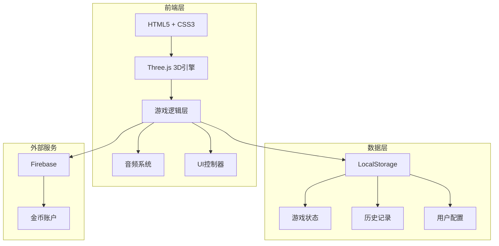

# 数学错题坦克大战 - 技术架构文档

## 1. 架构设计



## 2. 技术选型

### 2.1 核心技术栈

| 技术 | 版本 | 用途 |
|------|------|------|
| HTML5 | - | 页面结构 |
| CSS3 | - | 样式和动画 |
| JavaScript | ES6+ | 游戏逻辑 |
| Three.js | r128 | 3D渲染引擎 |
| Web Audio API | - | 音效生成 |
| LocalStorage | - | 本地数据存储 |

### 2.2 技术说明

**不使用框架的原因**：
- 项目为单页面游戏应用，无需复杂状态管理
- 直接操作Three.js更灵活，减少学习成本
- 与现有项目（eyecare-3d等）保持技术栈一致
- 减少打包体积，加载更快

**Three.js 版本选择**：
- 使用 r128 版本，与现有项目保持一致
- 该版本稳定，API成熟
- 无需额外引入React Three Fiber等封装库

## 3. 文件结构

```
专注养小树/
├── tank-battle.html          # 主页面
├── tank-battle.css           # 样式文件
├── tank-battle.js            # 游戏逻辑
├── common.js                 # 公共函数（金币系统等）
└── .trae/documents/
    ├── tank-battle-prd.md    # 产品需求文档
    └── tank-battle-tech.md   # 技术架构文档
```

## 4. 模块设计

### 4.1 模块划分

| 模块 | 文件 | 职责 |
|------|------|------|
| 初始化模块 | tank-battle.js | 游戏状态初始化、事件绑定 |
| 3D场景模块 | tank-battle.js | Three.js场景、相机、渲染器 |
| 坦克模块 | tank-battle.js | 坦克模型、炮管控制、动画 |
| 炮弹模块 | tank-battle.js | 炮弹发射、飞行轨迹、碰撞检测 |
| 敌人模块 | tank-battle.js | 敌人生成、移动、被击中效果 |
| 特效模块 | tank-battle.js | 爆炸、烟雾、火焰粒子效果 |
| UI模块 | tank-battle.js | HUD界面、分数显示、准星 |
| 音频模块 | tank-battle.js | 射击音效、爆炸音效、背景音乐 |
| 数据模块 | tank-battle.js + common.js | 分数计算、金币发放、本地存储 |

### 4.2 核心类/对象设计

```javascript
// 游戏状态管理
const GameState = {
    mistakes: 0,           // 错题数量
    weaponLevel: 5,        // 武器等级 1-5
    ammo: 30,              // 当前弹药
    score: 0,              // 当前分数
    enemiesDestroyed: 0,   // 击毁敌人数量
    isPlaying: false,      // 是否游戏中
    timeRemaining: 60      // 剩余时间
};

// 武器配置
const WeaponConfig = {
    5: { fireRate: 200, damage: 100, accuracy: 0.95, ammo: 30, range: 100 },
    4: { fireRate: 300, damage: 80, accuracy: 0.85, ammo: 25, range: 80 },
    3: { fireRate: 400, damage: 60, accuracy: 0.75, ammo: 20, range: 60 },
    2: { fireRate: 500, damage: 40, accuracy: 0.65, ammo: 15, range: 50 },
    1: { fireRate: 600, damage: 20, accuracy: 0.55, ammo: 10, range: 40 }
};

// 3D对象引用
const Scene3D = {
    scene: null,           // Three.js场景
    camera: null,          // 相机
    renderer: null,        // 渲染器
    tank: null,            // 坦克组
    barrel: null,          // 炮管
    projectiles: [],       // 炮弹数组
    enemies: [],           // 敌人数组
    particles: [],         // 粒子数组
    terrain: null          // 地形
};
```

## 5. 核心算法

### 5.1 抛物线弹道计算

```javascript
// 炮弹初始速度计算（基于瞄准角度）
function calculateProjectileVelocity(barrelRotation, power) {
    const angleY = barrelRotation.y;  // 水平角度
    const angleX = barrelRotation.x;  // 垂直角度（仰角）
    
    const speed = power * 0.5;  // 基础速度
    
    return {
        x: Math.sin(angleY) * Math.cos(angleX) * speed,
        y: Math.sin(angleX) * speed,
        z: Math.cos(angleY) * Math.cos(angleX) * speed
    };
}

// 每帧更新炮弹位置（考虑重力）
function updateProjectile(projectile, deltaTime) {
    projectile.velocity.y -= 9.8 * deltaTime;  // 重力加速度
    
    projectile.mesh.position.x += projectile.velocity.x * deltaTime;
    projectile.mesh.position.y += projectile.velocity.y * deltaTime;
    projectile.mesh.position.z += projectile.velocity.z * deltaTime;
    
    // 更新旋转以匹配速度方向
    projectile.mesh.lookAt(
        projectile.mesh.position.x + projectile.velocity.x,
        projectile.mesh.position.y + projectile.velocity.y,
        projectile.mesh.position.z + projectile.velocity.z
    );
}
```

### 5.2 碰撞检测

```javascript
// 简化球体碰撞检测
function checkCollision(projectile, enemy) {
    const distance = projectile.mesh.position.distanceTo(enemy.mesh.position);
    const minDistance = projectile.radius + enemy.radius;
    return distance < minDistance;
}

// 地面碰撞
function checkGroundCollision(projectile) {
    return projectile.mesh.position.y <= 0;
}
```

### 5.3 精准度计算（散布）

```javascript
// 根据精准度添加随机偏移
function applyAccuracy(velocity, accuracy) {
    const spread = (1 - accuracy) * 0.3;  // 最大散布角度
    
    const offsetX = (Math.random() - 0.5) * spread;
    const offsetY = (Math.random() - 0.5) * spread;
    
    // 应用偏移到速度向量
    velocity.x += offsetX;
    velocity.y += offsetY;
    
    return velocity;
}
```

## 6. 性能优化

### 6.1 渲染优化

- **LOD（细节层次）**：远处敌人使用低多边形模型
- **视锥体剔除**：只渲染在相机视野内的对象
- **对象池**：重用炮弹和粒子对象，避免频繁创建销毁
- **纹理压缩**：使用压缩纹理减少显存占用

### 6.2 粒子系统优化

- 使用 `THREE.Points` 而非单独网格创建爆炸效果
- 限制同时存在的粒子数量（最多500个）
- 粒子生命周期结束后立即回收

### 6.3 内存管理

- 游戏结束时清理所有3D对象
- 使用 `geometry.dispose()` 和 `material.dispose()` 释放资源
- 取消所有动画帧请求和事件监听

## 7. 浏览器兼容性

| 浏览器 | 版本要求 | 支持情况 |
|--------|----------|----------|
| Chrome | 80+ | ✅ 完全支持 |
| Firefox | 75+ | ✅ 完全支持 |
| Safari | 13+ | ✅ 支持（部分特效降级） |
| Edge | 80+ | ✅ 完全支持 |

## 8. 安全考虑

- 所有游戏数据存储在本地，不涉及敏感信息
- 金币发放通过现有 `common.js` 的 `addCoins()` 函数，确保与系统一致
- 输入验证：错题数量限制在0-20范围内

## 9. 扩展性设计

### 9.1 未来可扩展功能

- **多人对战**：通过WebSocket实现
- **更多关卡**：不同地形和敌人类型
- **成就系统**：记录连续满分天数等
- **家长面板**：查看历史错题趋势

### 9.2 模块化设计

各功能模块独立，便于后续：
- 更换坦克模型
- 添加新武器类型
- 增加新的敌人类型
- 扩展特效系统
